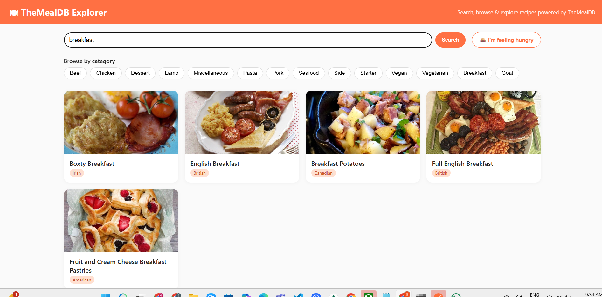
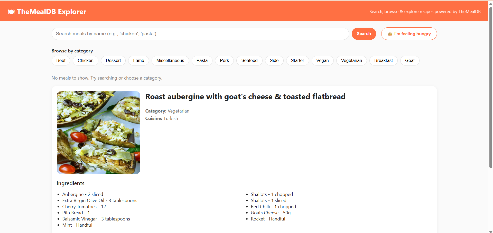

# 🍽️ TheMealDB Explorer

TheMealDB Explorer is a full-stack recipe browsing application built with **Node.js (Express)** and **React (Vite)**. It uses a custom backend layer to consume **TheMealDB public API**, implementing **in-memory caching** (5 min TTL + max 100 items) to optimize performance and reduce external requests. Users can search meals, browse by category, view full recipe details including ingredients & instructions, and watch YouTube tutorials. The UI is fully responsive and mobile-friendly.

Deployed Link : https://themealdb-explorer-frontend.onrender.com/

---
## 🚀 Screenshot


### 🔍 Search Page


### 🍽 Meal Detail


## 🚀 Features

- 🔍 Search meals by name (e.g., chicken, pasta)
- 📂 Browse meals by category
- 🎲 Random recipe – *I’m feeling hungry*
- 📜 Full recipe details: ingredients + instructions
- ▶ YouTube cooking tutorial embed
- ⚡ Backend caching (TTL + LRU style)
- 📱 Responsive UI (mobile + desktop)
- 🧠 Clean REST API architecture

---

## 🧱 Tech Stack

| Layer | Technology |
|-------|------------|
| Frontend | React, Vite, JavaScript |
| Backend | Node.js, Express, Axios |
| Cache | In-memory cache |
| API | TheMealDB (public test key `1`) |
| Styling | Custom CSS |

---

## 📁 Folder Structure

```
themealdb-explorer/
  backend/        # Express REST API + cache
    src/
  frontend/       # React UI (Vite)
    src/
```

---

## 🛠 Backend Setup (http://localhost:4000)

### Install dependencies
```bash
cd backend
npm install
```

### Start backend
```bash
npm run dev
```

### REST API Endpoints

| Method | Route | Description |
|--------|--------|-------------|
| GET | `/api/health` | API status check |
| GET | `/api/meals/search?query=<term>` | Search meals |
| GET | `/api/meals/random` | Random meal |
| GET | `/api/categories` | List categories |
| GET | `/api/meals/category/:name` | Meals by category |
| GET | `/api/meals/:id` | Meal details |

---

## 🎨 Frontend Setup (http://localhost:5173)

### Install dependencies
```bash
cd frontend
npm install
```

### Start frontend
```bash
npm run dev
```

The frontend communicates with backend via:
```
http://localhost:4000/api
```
(or configurable using `VITE_API_BASE`)

---

## 📦 Build for Production
```bash
cd frontend
npm run build
```

---

## 📌 API Reference
Public API key used: **1**  
https://www.themealdb.com/api.php

---


## 📤 Submission

- Upload to **public GitHub repository**
- Include this README.md
- Reply to email with repo link (do not change subject)

---

## 👨‍💻 Author

**Girija Singhal**

---


